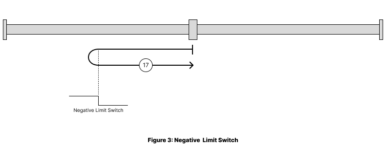
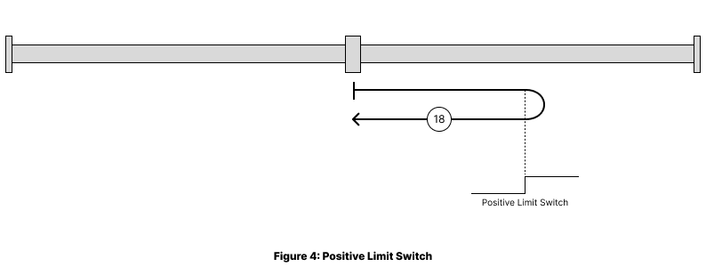
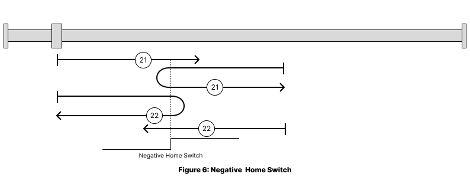

# Operation Mode

## Table of Contents
- [Introduction & Basic Concepts](#introduction--basic-concepts)
- [Available Modes](#available-modes)
- [Configuration & Setup](#configuration--setup)
## Introduction & Basic Concepts

### What is Mode of Operation?

The Q-Drives controller behavior depends on the activated mode of operation. The device may implement several modes of operation. Since it is not possible to operate the modes in parallel, the user is able to activate the required function by selecting a mode of operation. The control device writes to the modes of operation object <strong>(6060h)</strong> in order to select the operation mode. The drive device provides the modes of operation display object <strong>(6061h)</strong> to indicate the actual activated operation mode. Controlword, statusword, and set-points are used mode-specific. This implies the responsibility of the control device to avoid inconsistencies and erroneous behavior. The switching between the modes of operation implies no automatic reconfiguration of COBs for real-time data transmission. Therefore, the PDS may limit mode switching in one or some PDS FSA state(s). Mode switching may also be limited to the 'local control' function; this means it is not possible to select the operation mode via the network.

**Important Notes:**
- Mode changes typically require the device to be in Pre-operational state
- Not all modes may be supported on every device variant
- Check object 6502h to verify available modes before attempting to switch

---

## Available Modes

The following modes of operation are implemented: 

| Mode                   | Selector | Description                       |
|------------------------|----------|-----------------------------------|
| Profile Position Mode  |     1    | Mode for Positioning              |
| Velocity Mode          |     2    | Mode for Traction                 |
| Homing Mode            |     6    | Mode for select a Homing Position |

---

## Configuration & Setup

### Essential Objects
| Object                     | Index | Description                                                  |
|----------------------------|-------|--------------------------------------------------------------|
| Modes of operation         | 6060h | Set the desired operation mode                               |
| Modes of operation display | 6061h | Shows the current active mode                                |
| Supported homing methods   | 60e3h | Indicates which homing methods are available                 |
| Supported drive modes      | 6502h | Indicates which modes are available                          |
| Controlword                | 6040h | Indicates the received command controlling the state machine |
| Statusword                 | 6041h | Provides the status of the state machine                     |

### How to select a operation mode?

he control device writes to the modes of operation object (6060h) in order to select the operation mode. 
---

## Profile Position - Mode 1

### Description
Point-to-point positioning with built-in trajectory generation for precise positioning applications.

### Essential Objects
| Object                      | Index | Description                                  |
|-----------------------------|-------|----------------------------------------------|
| Position Trajectory         | 2042h | Parameters for position trajectory           |
| Position Select Table       | 2045h | Predefined position values for selection     |
| Position target value       | 607Ah | Commanded position (absolute/relative)       |
| Position demand value       | 6062h | Demanded position value                      |
| Position actual value       | 6064h | Demanded position value                      |
| Software position limit     | 607Dh | Min/max position limits                      |
| Max profile velocity        | 607fh | Maximum velocity limit                       |
| Profile velocity            | 6081h | Maximum velocity during motion               |
| Profile acceleration        | 6083h | Acceleration rate                            |
| Profile deceleration        | 6084h | Deceleration rate                            |
| Profile type                | 6086h | Type of trajectory (0=linear, 1=sin², etc.)  |
| Position encoder resolution | 608fh | Configuration of position encoder resolution |
| Gear ratio                  | 6091h | Configuration of gear ratio                  |
| Feed constant               | 6092h | Configuration of feed constant               |

### Control Sequence
1. Set target position (607Ah)
2. Configure velocity and acceleration parameters
3. Set controlword bit 4 (new set-point) to start motion
4. Monitor statusword bit 10 (target reached) for completion

---

## Velocity Mode - Mode 2

### Description
Simple velocity control with ramp functions.

### Essential Objects
| Object                      | Index | Description                                  |
|-----------------------------|-------|----------------------------------------------|
| Speed Trajectory            | 2041h | Parameters for speed trajectory              |
| Speed Select Table          | 2044h | Predefined speed values for selection        |
| vl target velocity          | 6042h | Desired velocity setpoint                    |
| vl velocity demand          | 6043h | Demanded velocity endpoint                   |
| vl velocity actual value    | 6044h | Current velocity feedback                    |
| vl velocity min max amount  | 6046h | Velocity limits                              |
| vl velocity acceleration    | 6048h | Acceleration ramp settings                   |
| vl velocity deceleration    | 6049h | Deceleration ramp settings                   |
| Max motor speed             | 6080h | Maximum rotational speed                     |
| velocity encoder resolution | 6090h | Configuration of velocity encoder resolution |
| Gear ratio                  | 6091h | Configuration of gear ratio                  |
| Feed constant               | 6092h | Configuration of feed constant               |
| Velocity Factor             | 6096h | User-defined Velocity units                  |
| Acceleration factor         | 6097h | Defines scaling factors for acceleration     |

### Control Bits
- **Bit 4**: Enable ramp (0=other control, 1=ramp follows input)
- **Bit 5**: Unlock ramp (0=locked, 1=follow reference)
- **Bit 6**: Reference ramp (0=zero input, 1=follow reference)
- **Bit 8**: Halt (0=no command, 1=stop motor)

---

## Homing Mode - Mode 6

### Description
Establish absolute position reference using various homing methods.

### Use Cases
- Finding machine zero position
- Establishing absolute coordinate system
- Initial positioning after power-up

### Common Homing Methods
| Method | Description                      |
|--------|----------------------------------|
| -1/-2  | Negative/Positive Mechanical Limit |
| 17/18  | Negative/Positive Limit Switch     |
| 19/20  | Positive Home Switch              |
| 21/22  | Negative Home Switch              |
| 37     | Homing Current Position          |

### Method -1/-2: Negative/Positive Mechanical Limit

With this method, as shown in Figure 1, the direction of movement is negative until the mechanical end stop is reached. When a predefined current threshold is exceeded, the homing position is reached, and the position is set as the homing position.

With this method, as shown in Figure 2, the direction of movement is positive until the mechanical end stop is reached. When a predefined current threshold is exceeded, the homing position is reached, and the position is set as the homing position.

### Method 17/18: Negative/Positive Limit

Using this method as shown in Figure 3, the initial direction of movement shall be leftward if
the negative limit switch is inactive (here: low). The home position shall be at the first homing pulse to the right of the position where the negative limit switch becomes inactive.

Using this method as shown in Figure 4, the initial direction of movement shall be rightward if
the positive limit switch is inactive (here: low). The position of home shall be at the first homing pulse to the left of the position where the positive limit switch becomes inactive.

### Method 19/20: Positive Home Switch

Using this method as shown in Figure 5, the initial direction of movement shall be dependent on the state of the home switch. If the initial position is situated so that the direction of movement shall reverse during homing, the point at which the reversal takes place is anywhere after a change of state of the home switch.

### Method 21/22: Negative Home Switch

Using this method as shown in Figure 6, the initial direction of movement shall be dependent on the state of the home switch. If the initial
position is situated so that the direction of movement shall reverse during homing, the point at
which the reversal takes place is anywhere after a change of state of the home switch.

### Method 37: Homing Current Position

Using this method as shown in Figure 7, the position of home shall be at the initial position.

### Essential Objects
| Object                  | Index | Description                        |
|-------------------------|-------|------------------------------------|
| Homing                  | 2033h | Configuration for homing procedure |
| Home offset             | 607Ch | Offset from home position          |
| Homing method           | 6098h | Selected homing method             |
| Gear ratio              | 6091h | Configuration of gear ratio        |
| Feed constant           | 6092h | Configuration of feed constant     |
| Homing speeds           | 6099h | Search and zero speeds             |
| Homing acceleration     | 609Ah | Acceleration during homing         |
| Supported homing methods| 60e3h | Available Homing Methods           |

### Control Sequence
1. Set homing method (6098h)
2. Configure speeds and acceleration
3. Set controlword bit 4 to start homing
4. Monitor statusword bits 10, 12, 13 for completion/status

---

### Technical Support

For additional support beyond this documentation:

- **Website**: [www.q-drives.com](http://www.q-drives.com)
- **Contact**: technik@q-drives.com

---

### Version History
| Version | Date       | Changes                    | Firmware Version   |
|---------|------------|----------------------------|--------------------|
| 0.1     | 15.11.2024 | Initial release            | 2.01.6             |
| 1.1     | 11.08.2025 | Add Operation Modes        | 2.01.6             |
| 1.2     | 11.09.2025 | Update Object Dictionary   | 2.2.1 Build 112    |
| 1.3     | 11.09.2025 | Update operation modes     | 2.2.1 Build 112    |

---

**Document Information:**  
- **Firmware Compatibility**: 2.01.6 and later  
- **Standards**: CiA 301, CiA 402 compliant